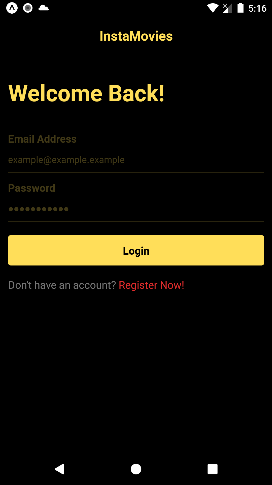
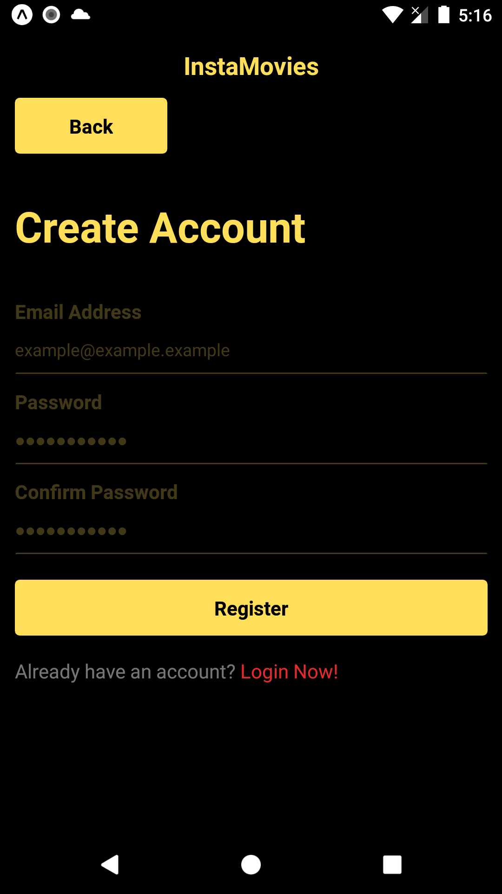
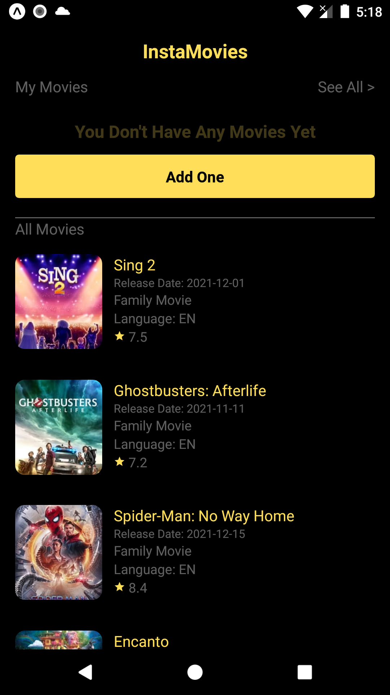
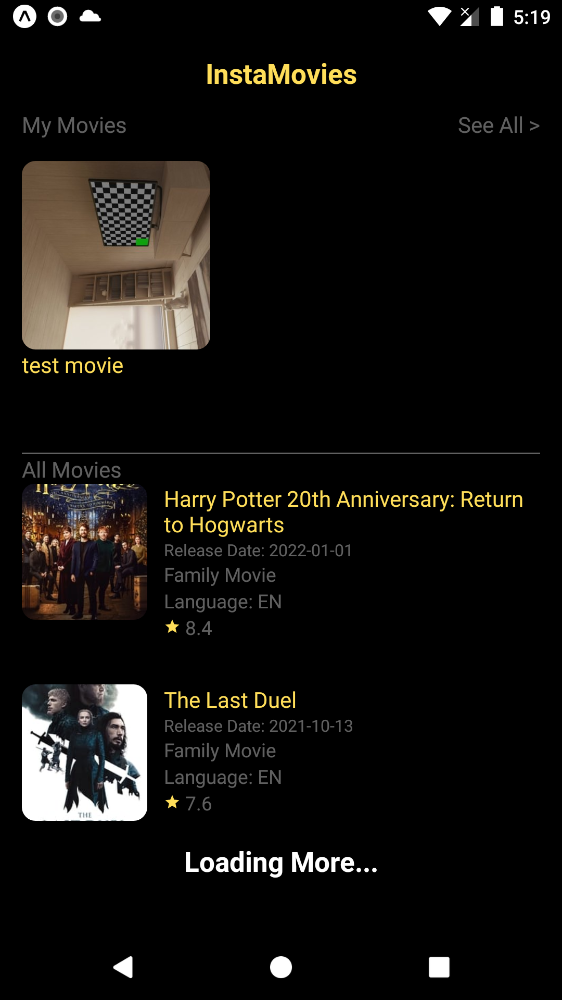
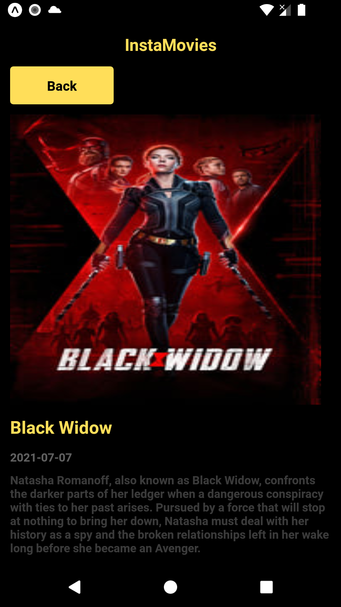
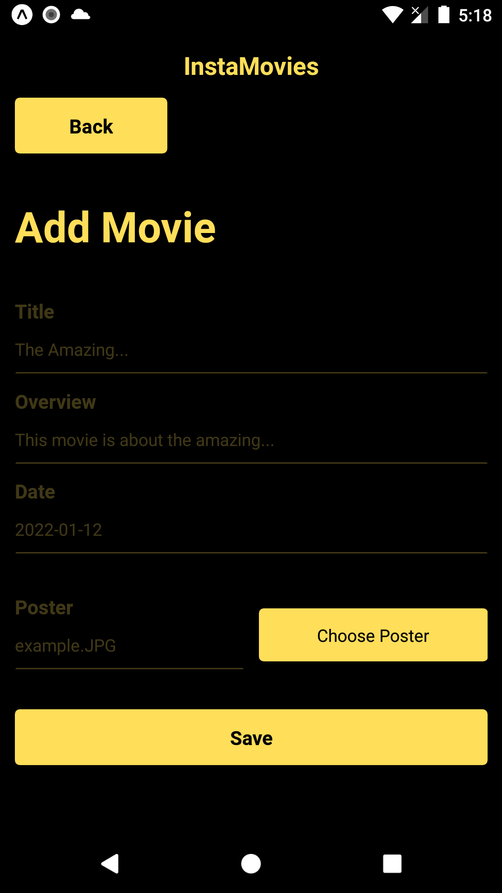
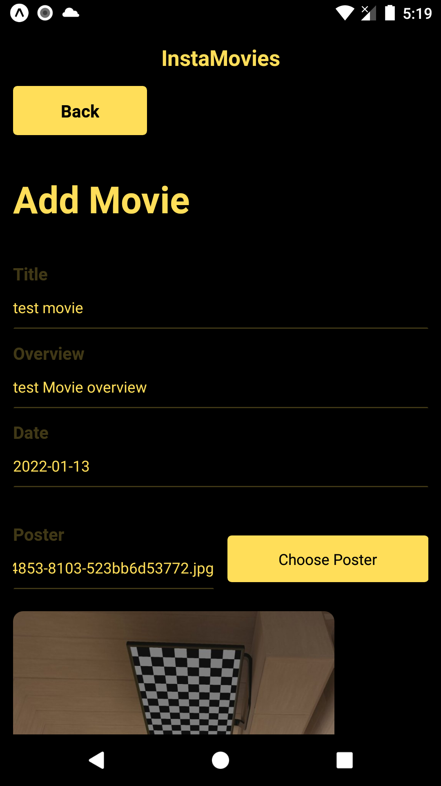
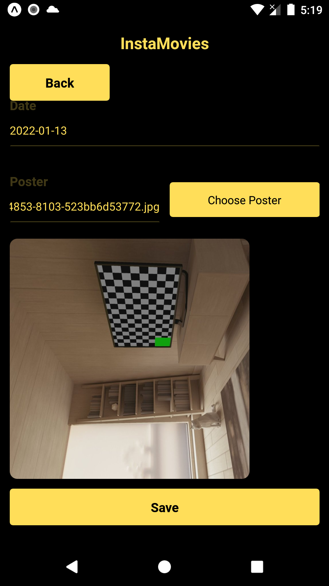
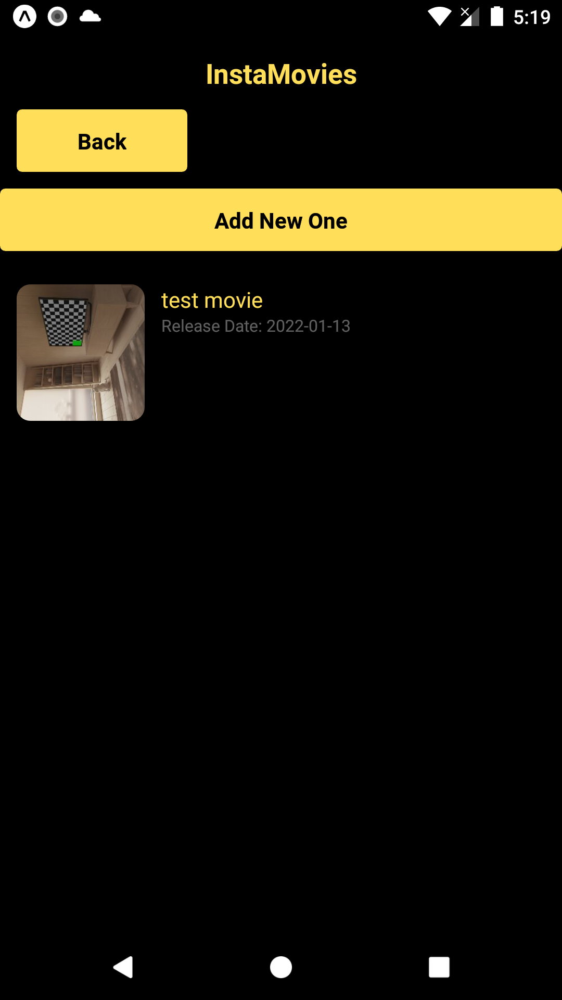
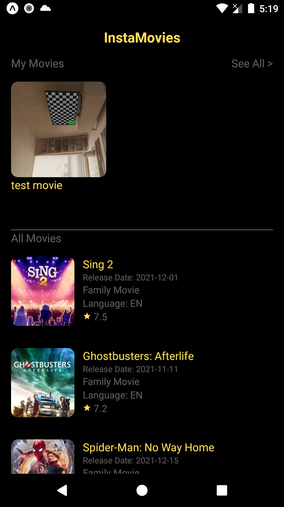

# InstaMovie Application Documentation

## Who am I? :

I’m Mohamed Sherif El-Marakby, 2021 graduate of Faculty of Engineering Ain Shams
university, 24 Years old Flutter Developer with two+ years of experience in the
field of cross platform using Flutter.

## Brief:

InstaMovie is a cross-platform mobile application for both Android, and IOS. The
user can create an account and login and use the application’s functionalities,
which is mainly about getting all the movies from themoviedb API, users can
check the movies their title, overview, date, and the poster of the movie. Users
can also insert their own movies where they can write the title, overview, date,
and the poster of it. The list of all movies fetched from the internet is to be
shown at all movies, and the list of the users’ inserted applications are to be
shown in their movies list separated from the movies fetched from the internet.
The Adobe Xd file along with the two builds (Flutter apk, and React Native apk)
are provided at the end of the ReadMe, for the Flutter code either install and
run the Flutter Apk or open Your IDE on the Flutter Folder and run command
flutter pub get in the terminal, To run the application of react native You can
either install the apk or open the code in Your IDE and run npm install and it
will download all the necessary modules for the application to start then run
the command expo start or npm start and it’ll start the server once it’s done
You can choose the option of running on android emulator using the letter (a) on
the keyboard and it should start automatically normally.

## Building Process:

### 1. Design Phase: this is the first phase that contains the design process of the application’s logo and user interface made using Adobe Xd. I decided to go with the colors black and light orange (\#FFDE59) as my main color themes, also (\#DE2C2C) and (\#767676) for some of the texts, and for the font I chose (League Spartan) font; because they’re relaxing to the eyes and give this cool dark theme.

### 1.1 Logo: 

### 1.2 User Interface: in the user interface design I have thought through the documentation of the task that there’s a user that can have his own movies, so I created a registration and login screens so that the user can either create a new account or login with his registered one but I haven’t made their functionality work they’re just dummy screens to show the idea that we could possibly make this functionality later on when provided the authentication APIS. The Adobe Xd UI file is linked in the GitHub Repo, it’d be a great honor for me if You take a look at it.

## 2. Code Design Phase: I don’t have any experience in React Native so in this phase I started thinking with Flutter and decided that I would write the application on Flutter so that I could vision it more and search for the components needed in react native or interfaces, classes, and so on. In this phase I saw the model of the API’s response and built the model on it and started working on the code as the following.

### 2.1. Presentation Layer: which has the screens, common widgets, and resources managers such as colors manager, assets manager, strings manager, etc.

### 2.2. Business Logic Layer: which has the bloc states, and cubits of the application, in our case it’s going to hold the cubit and states of the movies

### 2.3. Data Layer: which has three things

### 2.3.1. Models Folder: which has the dynamic data model coming from the APIs

### 2.3.2. Repositories Folder: which contains the Interface of the webservices

### 2.3.3. WebServices Folder: which has the webservices of our APIs

### 2.4. Layers Communications: each layer has to communicate only to the next layer through one entry point, so the Presentation Layers talks only with the Business Logic Layer, and the Business Logic Layer communicates with the Data Layer through the Repositories/Interfaces, and the Repositories/Interfaces communicate with the webservices to do the mission needed from them, that data separation is in order to guarantee that each and every layer has his own missions and tasks and any change in another layer won’t affect it, makes the code easier to understand, and to maintenance it.

## 3. Flutter Screenshots:

### 3.1. Splash Screen

### 3.2. Login Screen

### 3.3. Register Screen

### 3.4. Home without My Movies Screen

### 3.5. Loading Indicator of Pagination

### 3.6. Movie Details Screen

### 3.7. Add Movie Screen

### 3.8. My Movies Screen

### 3.9. Home with My Movies Screen

## 4. React Native Screenshots:

### 4.1. Login Screen

### 4.2. Register Screen

### 4.3. Home without My Movies Screen

### 4.4. Loading Indicator of Pagination

### 4.5. Movie Details Screen

### 4.6. Add Movie Screen

### 4.7. My Movies Screen

### 4.8. Home with My Movies Screen

## 5. Finally

I was trying to make the react native application as close to the user interface
design, and clean code as much as I could with the help of Google,
Stackoverflow, react native docs, and YouTube react native channels. I’m very
proud of myself for getting that output having zero experience in react native.
Thanks for reading the documentation, and feel free to contact me anytime for
any questions or inquiries.

## 6. Links of the files

### 6.1. Folder Containing all the files: https://drive.google.com/drive/folders/1rkvdO8PLOo_z21dfl-LNFYRi5jvDapQy?usp=sharing

### 6.2. Adobe Xd Design: https://drive.google.com/file/d/1cffHre8BdOT27yMue7kyX83MvPd0X0n0/view?usp=sharing

### 6.3. Flutter APK: https://drive.google.com/file/d/1Fxu7L83m1qDUM84fvsrQN3iwEjaxeRLEy/view?usp=sharing

### 6.4. React Native APK: https://drive.google.com/file/d/1XWgEx8ILZ9QGQkLsblDArqEBwhW02jV7/view?usp=sharing

### 6.5. GitHub Repo: https://github.com/mohamed-elmarakby/InstaMovie
